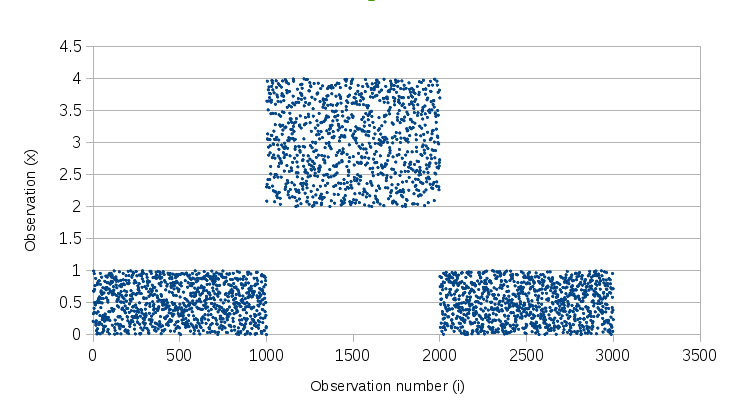
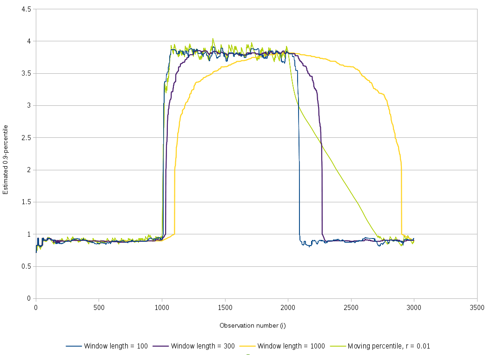

Windowless percentile tracking
===============================

This is a method driven by the same constraints as the [exponential moving
average](https://en.wikipedia.org/wiki/Moving_average#Exponential_moving_average),
but for median and other percentiles.

We present an algorithm for tracking the value of a
percentile, such as the median, in an infinite stream of observations whose
distribution can change over time. A self-imposed constraint is that
we cannot afford to keep the last _N_ observations explicitly in
memory. In our algorithm, the cost of updating the estimated
percentile is $O(1)$ and the memory usage is also $O(1)$. A single
parameter denoted $r$ is specified by the user and expresses the
trade-off between accuracy and reactivity (to changes in the
distribution of the signal).

Notations: in this document, all sequences and arrays are indexed
starting from 0.

Background: window-based algorithms
-----------------------------------

Given _N_ a fixed window length, it is relatively straightforward
to maintain a sorted array $W$ of the latest _N_ observations indexed
$0\dots N-1$.
The _p_-percentile is computed exactly over that window
by looking up the pair of values found at index
$\lfloor (N-1)p \rfloor$ and at index
$\lceil (N-1)p \rceil$, and by taking their average.

For example, the median $m$ (0.5-percentile)
using a window of length $N=100$ is
calculated as follows once we've read 100
observations or more:

$$m = \frac{W_{49} + W_{50}}{2}$$

Such algorithms are not acceptable for us since they require
storing the latest _N_ values, where _N_ is typically chosen greater than
100.

Background: exponential moving average
--------------------------------------

An exponential moving average is a weighted average of the previous
observations, in which the weight
of the latest observation is always set to a fixed parameter $r$
($0 \lt r \le 1$) and the weight of the other values is $(1-r)$ times
their previous weight.

After reading $\lfloor 1/r \rfloor + 1$ observations or more, the
moving average for observation _i_ is computed as follows:

$$m_i = r . x_i + (1-r) . m_{i-1}$$

In the initial phase where $i \lt \lfloor 1/r \rfloor$, $m_i$ is
calculated as the mean of all the observations so far. The rationale is that
the weight of the latest observation is the nearest possible to $r$
without being smaller than the weight any of the past observations.
This avoids having to set $m_{-1}$ to an arbitrary guess with a lasting impact.
Updating _m_ in this initial phase is done as follows:

$$\hat{r}_i = \frac{1}{i+1}$$
$$m_i = \hat{r}_i . x_i + (1-\hat{r}_i) . m_{i-1}$$

This exponential moving average algorithm is used in the moving
percentile algorithm described below to
estimate the standard deviation of the signal.

Moving percentile algorithm
---------------------------

The $p$-percentile is represented by the variable $m$. It is
initialized with the value of the first observation $x_0$:

$$ m_0 = x_0 $$

Subsequent iterations are updated as follows, for some value of
$\delta$ discussed later.

If $x_i < m_{i-1}$ then

$$ m_i = m_{i-1} - \frac{\delta}{p} $$

else if $x_i > m_{i-1}$ then

$$ m_i = m_{i-1} + \frac{\delta}{1-p} $$

else $x_i = m_{i-1}$ and keep the previous value:

$$ m_i = m_{i-1} $$

If $\delta$ is not too large and not too small, $m$ is a good estimate
of the $p$-percentile. Choosing a good value for $\delta$ depends on
the distribution of values around the $p$-percentile. Excessive values
of $\delta$ result in big jumps for _m_ and limit the accuracy, while
a $\delta$ that's too small may take too much time to converge to the
$p$-percentile as computed exactly using a window of a reasonable length.

In order to express the trade-off between accuracy and convergence speed,
we express $\delta$ as the product of a user-chosen constant _r_ and
the estimated standard deviation $\sigma$ of the input signal:

$$ \delta_i = \sigma_i . r $$

where $\sigma_i$ is the square root of the variance estimated by a
moving average of the sequence $(\mu_i - x_i)^2$ and $\mu$ is estimated by a
moving average of _x_.

We find that reasonable values of $r$ for many applications range
from 0.001 to 0.01.

The chart below shows our sample signal that was generated randomly in
3 phases:

* phase 1 (0-999): Uniform(0,1); expected 0.9-percentile = 0.9
* phase 2 (1000-1999): Uniform(2,4); expected 0.9-percentile = 3.8
* phase 3 (2000-3999): Uniform(0,1); expected 0.9 percentile = 0.9

The output for window-based percentile estimators and for our moving
percentile are shown here:

Our moving 0.9-percentile, shown on the chart in green, reacts quickly
when the signal shifts upward, because each update shifts the moving
percentile upward by $\frac{\delta}{0.1}$. However, when the signal shifts
downward, it takes the moving percentile more time to react because
each update shifts it downward by $\frac{\delta}{0.9}$, which is 9
times less than in the other direction. Additionally, we can see that
the downward shift is pretty steep initially and then gets less
steep. This is due to the delayed update of the standard deviation
$\sigma$: the value of $\delta$ is divided by two when the estimated
$\sigma$ catches up and is divided by two, reflecting the new
distribution in phase 3.

A sample implementation is
[available on GitHub](https://github.com/mjambon/moving-percentile).
