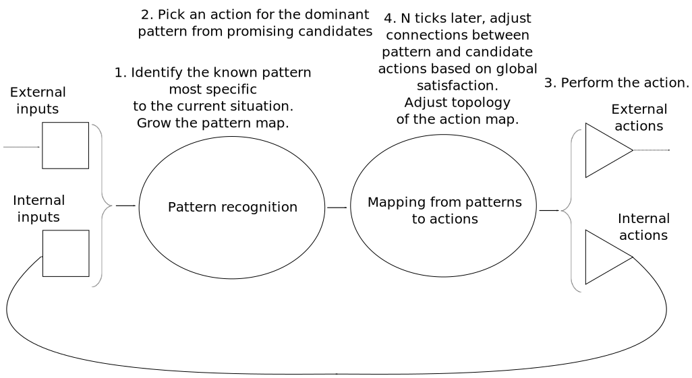
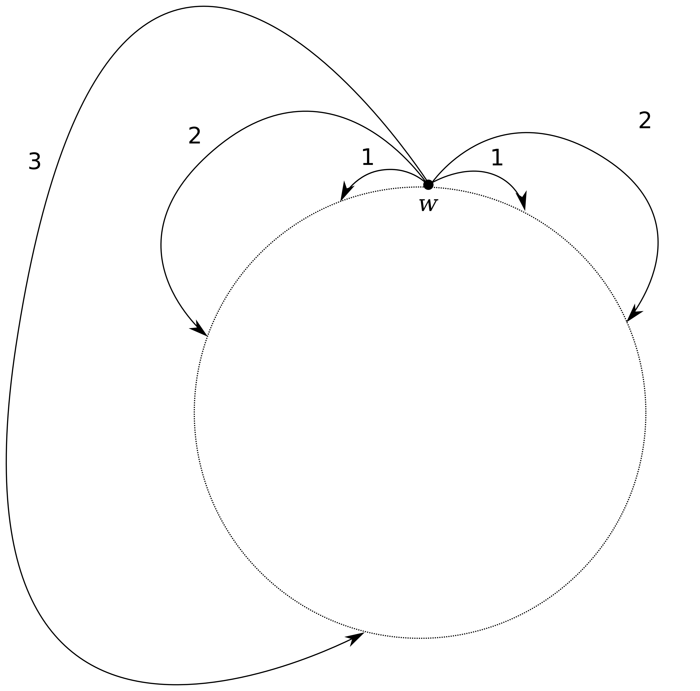

% AGI research snapshot, 2016
% Martin Jambon
% August 2016

<!-- toc -->

# Motivations

I have been working on and off since 1999 on ideas and programs with
the aim of eventually achieving artificial general intelligence
(AGI).

This is a write-up of my current thoughts, approaches, and
designs. While we don't have a working AGI system yet, it seems like a
good idea to share the state of my research with others.

# A practical definition of general intelligence

From the beginning my goal has been to come up with
software running on commodity computers that demonstrates _some
intelligent behavior_. It's not about rivaling humans at typical human
activities such as playing games or classifying images. It's about
demonstrating modest but real bits of general intelligence.

## Framework for defining and evaluating intelligence

We'll define general intelligence, or intelligence for short, within
the following informal framework:

1. Some definition of time.
2. A world, that no information can penetrate.
3. At a given date, the current state of the world can be computed
   from a previous state of the world.
4. Events, which are modifications of the state of the world occurring
   at a given time.
5. A system which is part of the world. The rest of the
   world is called the environment.
6. The system can acquire some information from the world via inputs.
7. The system can modify the state of the world via outputs also known
   as actions.
8. An objective function that we want the system to minimize, i.e.
   how well the system is doing, given as a real number ranging from 0 to 1.
9. The objective function is determined from the state of the
    world.
10. Values of the objective function may be fed as input to the system
    but it is not a requirement.
11. Some correlation between input events and inputs of the objective
    function. This can achieved by encoding values of the objective
    function into some suitable input for the system.
12. Some influence of the outputs on the inputs of the objective
    function.
13. An observer can inspect the world and the system without
    affecting them.

Within this framework, we define general intelligence as:

> A system's intelligence is measured by how fast it learns to
  optimize the objective function in an arbitrarily new environment,
  compared to a younger version of itself.

An example of an arbitrarily complex environment is a setup
where multiple systems compete for a resource, such as food.
Each system views the
other systems as part of the environment. When a system's objective
function, or health, becomes too low, it is removed from the
environment and the healthiest of the systems is cloned.

## Sample method for evaluating intelligence

In our framework, the world $W$ is partitioned into a system $S$
and an environment $E$:

$$
W = S \oplus E
$$

The state of both the system and the
environment changes over time, but their interface remains compatible.
This means that any state of the system can be combined with any state
of the environment, for evaluation purposes.

Let $\phi(t_0, E_0, S_0, t) \in [0,1]$ denote the application of the objective
function $\phi$ to the initial conditions $t_0$, $E_0$, and $S_0$, and
to the date $t$. $t_0$ is the origin of time, $E_0$ is the initial
state of the environment $E$, and $S_0$ is the initial state of the
system $S$.

Given $t_1$ and $t_2$ future dates such that $t_0 < t_1 < t_2$, the
performance $\lambda$ of the system from $t_1$ to $t_2$ is given by:

$$
\lambda(t_1, t_2, E_1, S_1) =
   \int_{t_1}^{t_2} \phi(t_1, E_1, S_1, t) dt
$$

where $E_1$ is the state of the environment at $t_1$ and likewise,
$S_1$ is the state of the system at $t_1$.

The intelligence $I$ of the system $S$
can be defined by comparing the performance
of the naive system $S_0$ with the more experienced system $S_1$
starting in the new environment $E_1$.

$$
I(t_0, t_1, t_2, E, S) =
   \lambda(t_1, t_2, E_1, S_1) - \lambda(t_1, t_2, E_1, S_0)
$$

This is straightforward to compute if we can save and restore
the state of the world, i.e. if such world is a simulation in our
control.

Note also that according to this definition, a system is intelligent
if from $t_0$ to $t_1$ it learns something useful for dealing with the
environment encountered from $t_1$ to $t_2$. A system that performs
already well at $t_0$ but can't learn anything new won't be considered
intelligent even if it outperforms most other systems for optimizing the
objective function. Humans might refer to such individual as wise, but
as far as we are concerned, it is no longer capable of general
intelligence.

## Criticism of the system/environment duality

Our framework is based on a separation between a system and its
environment. This matches the view that the human intelligence is
determined by the brain, located in the human body which has clear
physical boundaries.

An intelligent system is fundamentally open as it exchanges
information with its environment, by definition.
By modifying the environment to improve its success, the system
can become intimately dependent on it.
Tools and cooperation are prime examples of co-evolution
of an intelligent system and its environment.

### Tools

Tools are external resources that are not typically treated as part of
the intelligent system, but are key to a more efficient use of the
environment by a system who learned to use those tools.

### Cooperation

Cooperation can emerge when other intelligent systems exist in the
world and they benefit from working together.
Groups of humans are typically not considered as sharing a brain,
despite living in organized societies with individuals having widely
different roles. This is highly beneficial to the group.
Indeed, single humans having to sruvive without contacts with other humans,
even with some tools, tend to do much more poorly than as an organized
group.

### An acceptable compromise

The expectation of tools and cooperation are reasons why a good,
general definition of intelligence may
not define a system as a clear-cut piece of the world.
Instead, one might want to base a definition of intelligence
on notions such as the time it takes to
obtain information, regardless of whether this information is obtained
by sensing, by reasoning, or by querying resources using some language.

It seems that we could obtain a simpler definition of intelligence
by eliminating the complex framework required to by the
system/environment model, which we haven't even tried to define
formally.

Note that we may not need a formal definition of intelligence in order to
design and implement software that achieves our goal of AGI. We'll
stick with the system/environment model as it corresponds closely to
how machines are defined and constructed.

# Other useful definitions of intelligence

## Intuition

_General intelligence is the ability to become familiar with arbitrary
structures._

This view focuses on two main notions. The first one is that knowledge
about the world can be modeled as some sort of graph that relates
different concepts. The second notion is that not only any kind of
knowledge can be acquired, but also that with enough exposure to the
relevant information, an intelligent system can become capable of quickly
making predictions and turning them into assumptions. For example,
when seeing four fingers from a partially hidden human hand, one assumes
unconsciously that there is a fifth finger hidden.

In contrast, statistical learning or machine learning would lack the
mechanisms allowing it to make good predictions for arbitrary data,
hence the more restricted definition of learning:

_Learning is the ability to become familiar with some structures._

Cognitive activities such as imagination, intuition, and unconscious
bias are related and are characteristic of all systems capable of
learning.
Among them, systems capable of general intelligence distinguish
themselves by the ability, given enough time, to correct or
override unconscious bias.

## Self-control

_General intelligence is characterized by the ability to develop
new behaviors and to adopt or maintain a behavior independently from the
immediate environment._

This characterization of intelligence is not a full definition, but
more of a necessary condition of how a system should work internally
for the system's creators to maintain a hope of achieving general
intelligence.

A related definition mentions goals rather than behaviors but we treat
them as roughly equivalent. A behavior is a way of a
achieving a goal. It can be seen as the activation of a subsystem and
the maintenance of this state for as long as the system is pursuing
the goal. By preferring the term behavior over goal, we wish to leave
aside the questions of consciousness and free will.

A simple example is the decision for an animal to climb a mountain even
though it requires a lot of energy. A naive individual might simply
try to avoid going up whenever possible because it consumes energy,
which requires finding more food. A more experienced individual may
however push itself
to go against its original instinct to not go uphill, and this would
require a behavior or goal that could be called
"exploration". A long-term benefit would be to find a more prosperous
valley on the other side of the mountain. Achieving this result
necessitates adopting an originally unintuitive exploratory behavior.
Once the whole mountain range has been explored, though, the system
should switch to another behavior such as exploiting the newfound
resources, while not spending too much effort climbing mountains.

# Considerations about the methodology

## Modularity and testability

Successful software architectures are made up of components that can
be tested independently. The reason for that is not structural. The
human brain works extremely well despite a very intricate
structure. However the human brain is not a machine in the sense that
it wasn't designed, built, and modified by engineers. Instead it
evolved in the least efficient way, which happens to be how some
programming beginners modify existing programs: by single mutations
and repeated trial-and-error over the whole system. In the case of the
human brain, it's a process involving the life of one or multiple
human individuals who carry a new version of a gene or some other
genetic variant. Given favorable testing conditions in the
environment, the proportion of individuals with this version of the
gene will increase or decrease
within the population, generation after generation. So it is
possible to change a random line of code in a program and run the
whole program in many possible scenarios. However, it is not only very
slow to introduce new features or fix problems this way, it also
results in incomprehensible source code that forces future engineers
to adopt the same slow trial-and-error approach.

In short, good software engineering practices must be used. The system
is made up of components. Each component interacts with other
components via a clear interface and shall be tested independently from
the other components. A component itself is usually made up of
subcomponents, with the same property of testability.

## Simplicity

A simpler system is not just cheaper to develop because of its reduced
size. There are also fewer parameters to adjust manually, and such
parameters are not always numeric. It could be that instead of one
component, we have two components meant for different functions and
they might slightly differ in their structure. We will try to avoid
manually designing components of similar structure, whenever possible.

# Computational model

For our system, as well as test environments, we prefer
architectures and models that are as discrete as possible. It makes
computation more straightforward with digital computers and it eliminates
the need for debatable thresholds to determine the boundaries of
various components.

## Discrete time

Our system's unit of time, or tick, is defined by one computation
cycle. The actual physical time it takes for the system to perform a
cycle may vary. As we will eventually be concerned with interacting
with the physical world, we design our system such that a
computation cycle can terminate within a fixed amount of physical
time, i.e. real-time, given realistic hardware.

In particular, a computation cycle will be defined such that it is
trivial to decompose it into simple steps that can
be performed in parallel, assuming uniform random-access memory
(RAM).
Thus, accessing data from anywhere in the system has a bounded, reasonable
cost in physical time. RAM may be an area where modern computers
already surpass biological brains and we will take advantage of it
since our goal is not to simulate such brain.

## One node per abstraction

Our system is made up of nodes of a small, fixed number of types. Nodes are
connected together in certain ways to form a graph that allows
information to propagate.

A strong design principle that we follow is that once created and
connected, the function of a node can be retraced by inspecting the
structure of the graph.

As a consequence, we design our system such that information
propagates as an all-or-nothing signal along the edges of the graph.
At a given time, a node is either active or inactive, never in an
intermediate state. This is a fundamental difference with artificial neural
networks (ANN).

A possible benefit from propagating only binary
information is that large inactive parts of the system can remain at
rest, i.e. propagate only zeros, without requiring any
computation. Only active nodes are involved in computing information to
propagate as ones. This is what can call the economy rule.

**Economy rule**: Given the subset $S$ of nodes stricly needed to determine
whether some node $v$ should be active or inactive at the next cycle,
all the nodes in $S$ being inactive implies that $v$ will be
inactive.

Sticking to the economy rule disallows logic gates that produce ones from
only zeros, i.e. unary _not_ or _neither-of_ activation rules
may not exist.

The economy rule is implemented by inactivating all previously-active
nodes unless they are activated by other nodes, of which at least one
was previously active.

The number $\lvert S\rvert$ of nodes needed to determine the state of
another node is bounded. It is 1 or 2 in our current design.
Therefore the cost of computing the next state of the nodes of the
system is $O(\lvert A\rvert)$ when $A$ designates the set of
active nodes at a given cycle, rather than the total number of nodes.

# Architecture

## Overview

As envisioned, our system is made up of three major
components:

1. Pattern recognition subsystem: A built-in perception subsystem that reads
   inputs and activates
   internal nodes that represent concepts, i.e. patterns identified in
   the input.
2. Action optimizer: A built-in action subsystem whose role is to
   connect internal nodes to optimal output nodes, given a built-in
   objective function.
3. Input-Output (IO) modules which create input nodes and output
   nodes and can perform arbitrary computations and interactions with
   the environment.

The inside of the system is what carries information from the input
nodes (squares $\Box$) to the output nodes (triangles $\rhd$). It
views input nodes and output nodes as unordered sets, with no
_a priori_ knowledge of their role.

Input nodes and output nodes can be more or less built-in, depending on
the implementation.
In any case, IO modules (3) are independent pieces of software that can
create input nodes and output nodes freely, either during system
initialization or later, dynamically. IO modules
are responsible for activating and deactivating their input nodes, and
they are supposed to read the binary state of the output nodes and do
something with it.

## Perception

### Input nodes and internal nodes

The subsystem in charge of pattern identification or perception is
made up of nodes. At a given cycle or tick of the system's clock, a
node is either active or inactive. There are two kinds of nodes and
they differ in the way they are activated. The input nodes, always
represented by squares, are activated by IO modules. The other nodes
are referred to as internal nodes or regular nodes and are activated
by a pair of other nodes.

The diagram below shows 4 input nodes and 3 internal nodes.

An internal node can be created from any pair of nodes. For instance
it could be one input node and some other internal node:

The slightly more complicated example below shows various ways to
connect nodes.

It takes one tick of the clock to propagate information along an edge.
An internal node $C$ constructed from nodes $(A,B)$
is active at date $t$ if and only if
nodes $A$ and $B$ are active at date $t-1$. It is inactive otherwise.

Once an internal node is created, it will always receive information from the
pair of nodes it was constructed from. It is an indicator of the
current and recent input and implements a concept.

### Redundancy issues

Given some input nodes, infinitely many internal nodes can be
constructed. The key of a successful design is to construct
internal nodes that represent useful concepts or that are involved in
the construction in useful concepts, without creating too many nodes
that are either redundant or not useful.

The diagram below shows how two internal nodes can be equivalent in
the sense that their activity state is the same for any input. These
are nodes denoted ABCD and ACBD, which are active at date $t$ iff each
of the input nodes A, B, C, and D are active at date $t-2$.

More undesired redundancy could occur when multiple input nodes are
equivalent. Since these input nodes are given and may not be removed
from the system, we need a way to avoid producing redundant internal nodes.
Here is such a case, where we assume that A and A' are always active at the
same time. We do not want to end up with the following construction
where AB and A'B are equivalent:

### Criteria that make an internal node worth creating

At this point, the best idea we have about what makes a good internal
node are those two properties:

* No excessive similarity with any existing node
* Frequent activity ahead of difficult situations

We define the similarity of the activity of two nodes $A$ and $B$
over a time window as the Jaccard index $J(\alpha(A),\alpha(B))$.
$\alpha$ denotes a sequence of dates at which a node is active:

$$
\alpha(A, t_1, t_2) =
  \{ t \in [t_1, t_2] | A\ \mathrm{is\ active\ at\ date}\ t \}
$$

$J$ is the ratio of the frequency at which both nodes
are active to the frequency at which at least one node is active:

$$
\begin{align}
J(\alpha(A), \alpha(B)) &=
  \frac{\lvert \alpha(A) \cap \alpha(B) \rvert}
       {\lvert \alpha(A) \cup \alpha(B) \rvert} \\
&= \frac{\lvert \alpha(A) \cap \alpha(B) \rvert}
        {\lvert \alpha(A) \rvert
         + \lvert \alpha(B) \rvert
         - \lvert \alpha(A) \cap \alpha(B) \rvert}
\end{align}
$$

Example:

> $\alpha(A) = \{ 3, 5, 6, 9, 10, 12, 14, 15 \}$  
$\alpha(B) = \{ 3, 4, 6, 9, 10, 11, 14 \}$  
$\alpha(A) \cap \alpha(B) = \{ 3, 6, 9, 10, 14 \}$  
successive states of A: 00010110 01101011  
successive states of B: 00011010 01110010  
$\lvert \alpha(A) \rvert = 8$  
$\lvert \alpha(B) \rvert = 7$  
$\lvert \alpha(A) \cap \alpha(B) \rvert = 5$  
$J(\alpha(A), \alpha(B)) = 0.5$

Note that the frequency at which neither $A$ nor $B$ is active has
no impact on their similarity.

Another criterion for deciding whether to create a node is its
importance. The importance of a node can be captured by evaluating the
degree of control of the system's objective function or mood following
the activation of the node. The intuition is that such a node can be a
sign that some dramatic, hard-to-control changes in the environment
are about to occur because it has been like this historically.
The existence of this node gives us an opportunity to
perform an action upon its activation, and it may help control the
situation. We loosely refer to quick changes in the system's
mood as stress.

Given a system-global objective function referred to as mood or
$\phi$, we define stress over a time window $[t_1, t_2] \subset
\mathbb{Z}$ as the total variation of $\phi$ divided by the window length:

$$
\mathrm{stress}(\phi, t_1, t_2) =
  \frac{
     \sum_{t = t_1}^{t_2-1} \lvert \phi_{t+1} - \phi_{t} \rvert
   }
   {t_2 - t_1}
$$

### Outline of a growth mechanism

An input node or an internal node holds a binary reversible state that
we call maturity. An internal node can only be created from two mature
nodes.

A node $A$ is mature iff the following properties hold:

* $A$ has ever been active some minimum number of times,
  i.e. $|\alpha(A)|$ is greater than some threshold.
* When $A$ is active, it is also the dominant node frequently enough.
  The definition of a dominant node is given below.

At any given time, one of the active nodes is designated as the
dominant node. The dominant node is meant to represent the concept
that is most relevant to the current situation.

There is no strict definition of the rules for choosing a dominant
node at this time. A possibility is to compute a score for each active
node and choose the node with the highest score. Such score would
combine:

1. the average historical stress following the activation of the node
   over some period of time;
2. the inverse of the frequency at which the node is active and not
   dominant.

Term (1) is meant to favor nodes that are more important because a
difficult situation is likely to follow. Term (2) is meant to favor
the nodes most specific to the current situation while preferring
nodes that have been dominant before, giving them a first-mover
advantage.

The construction rule could be as follows: At each cycle, the score
used to determine the dominant node is computed for each active
node. A new node is created from the top two nodes $D_1$ (dominant)
and $D_2$ iff the following conditions hold:

* $D_1$ and $D_2$ are both mature;
* $0.5 \le J(\alpha(D_1), \alpha(D_2)) < 1$

The computation of $\alpha(D_1)$ and $\alpha(D_2)$ is delicate since
the obvious, naive approach would consist in memorizing all the dates
at which each node was ever active, which could take too much memory.
A simple workaround is to only memorize the last 100 dates or so
using delta encoding to reduce space requirements, and work out an
estimate of the Jaccard index $J$ using only this recent data.

## Output and reinforcement

### Problem

Given a set of nodes $V$ and a set of output nodes $W$, determine by
trial-and-error a mapping from $V$ to $W$ that maximizes our global
objective function $\phi$ over a period following each action picked
from $W$.

$V$ are internal nodes, which at a given instant are either active or
inactive. Some or all active nodes from $V$ are allowed to
perform an action triggered by an output node.
Among the internal nodes, some are not yet permanently bound to a
specific output node while others may have have established a stable
connection to a particular output.

The challenge is that initially the output nodes are not connected or
clustered in regions. There is no _a priori_ knowledge of which pairs
of output nodes are likely to produce similar outcomes. A simple
example would be 10 output nodes, each corresponding to a specific
speed of a vehicle in the set $\left\{ 0, 1, \dots, 9 \right\}$. In
this simple case, we know that speeds closer to 5 are 4 and 6. However
the system doesn't know this initially. We want the system to find out
by itself that when some nodes from $V$ are equally successful with two
outputs $w_1$ and $w_2$, this indicates that $w_1$ and $w_2$ are similar,
for this specific level of success.

### Desired result

We wish to connect a set $W$ of outputs into a labeled graph that can be used
to quickly explore and find a good output for a given internal node in
$V$. The graph shall be similar to a map, where the time it takes
to follow an edge is constant and the label associated with the edge
is the estimated distance between the nodes. The distance between two
nodes $w_1$ and $w_2$ is denoted $d(w_1, w_2)$.

Although output nodes typically don't belong to an Euclidean space,
the metric may be **locally** compatible with a Euclidean space of some
dimensionality. We'll refer to this idea informally as _local
dimensionality_, even though we don't have any explicit representation
of coordinates at any time. We define the locality of a node $w$ as
the set of nodes at a certain distance from $w$:

$$
\mathrm{locality}(d_1, d_2, w) = \{ u \in W\ |\ d_1 \le d(u, w) \le d_2 \}
$$

where $[d_1, d_2]$ is a range of distances.

All distances are normalized into $[0, 1]$. We define a partition
of the nodes of the graph into a small number of bins corresponding to
increasing distances from node $w$. The boundaries of the bins are
adjusted such that the population of the bins increases exponentially
as the distance increases.

For example we could define 5 bins of the following relative sizes:

* bin $B_1$: $\frac{1}{32}$
* bin $B_2$: $\frac{1}{16}$
* bin $B_3$: $\frac{1}{8}$
* bin $B_4$: $\frac{1}{4}$
* bin $B_5$: $\frac{1}{2}+\frac{1}{32}$ (everything else)

We might find that the radiuses that define the boundaries of these
bins should be set as follows in order to satisfy the ratios listed
above:

* bin $B_1$: $0 \dots 0.12$
* bin $B_2$: $0.12 \dots 0.30$
* bin $B_3$: $0.30 \dots 0.46$
* bin $B_4$: $0.46 \dots 0.74$
* bin $B_5$: $0.74 \dots 1$

In practice the goal is to estimate how many nodes of the graph fall
into each bin, and adjust the bin boundaries to ensure the
exponential distribution that we want to adopt.

Each bin will be used to actually hold a few samples only. These
samples are neighbors of $w$ within the range defined by the bin, and
they shall be as distant from each other as possible. They shall
represent directions or local dimensions worth exploring. The hope is
that locally, only a small number of dimensions are relevant and thus
only a small number of well-chosen nodes would be put into each bin.
Let's consider a bin denoted $B_i$ and nodes $u$, $v$ that would fall
into that bin:

$$
\begin{align}
d(w, u) & \in B_i \\
d(w, v) & \in B_i
\end{align}
$$

$u$ and $v$ may be put into the bin only if they are distant enough
from each other. Assuming that the distances are locally compatible
with a Euclidean space, a safe minimum distance is $\sqrt{2}$
times the radius:

$$
\begin{align}
d(u,v) & \ge \sqrt{2} \max(B_i) \\
\end{align}
$$

where $\max(B_i)$ denotes the maximum radius or upper bound of bin
$B_i$.

The hope is to end up for each given node $w$ with such collection of
bins, each holding a sample of nodes at different radiuses. Each bin
has a different granularity, and its own local dimensionality, which
indicates different directions worth exploring.

An example of a very simple topology is a circle. Given 3 bins $B_1$,
$B_2$, and $B_3$, here's is how bin elements could be distributed
along the circle:

Note how $w$ is connected to two nodes in the shorter ranges
$B_1$ and $B_2$ but can only be connected to one node in the longer
range $B_3$. In practice we expect to have to deal with more complex
topologies, but hopefully not with a large number of dimensions
locally. A ribbon for instance, at small scale resembles
a 2-dimensional Euclidean space, but at large scale it is
1-dimensional. Conversely, a spider web is 1-dimensional at small
scale but 2-dimensional at large scale.

This design would allow both reach and accuracy:

* Remote regions of the graph can be reached from any node in one hop.
* Non-redundant nearest neighbors can be reached in one hop.
* The number of edges per node is moderate, depending on local
  dimensionality at the given scale.

### Outline of a possible solution

### Dealing with high local dimensionality

# Sample internal IO modules

## Automatic IO modules

### Automatic activity feedback and action feedback

### Reminiscence

For each once-dominant node, a reminiscence module is created as shown
above. Each time the node is active again (dominant or not), the input
node is activated. That same input node can be activated via a
dedicated output node chosen by any dominant node. As a result, the
input node is always active one tick after the original node and can
also be activated artificially, triggering the same effects as a
natural activation.

## Optional IO modules

### A simple feedback loop, the transmitter

### Single-bit state

### Activator

### Toggle or 2-state round robin

# Test environments

## Testing pure pattern identification: small B&W images

## Testing reinforcement: reconstruct arbitrary topologies

## Full test: competition for resources on a 2D grid
