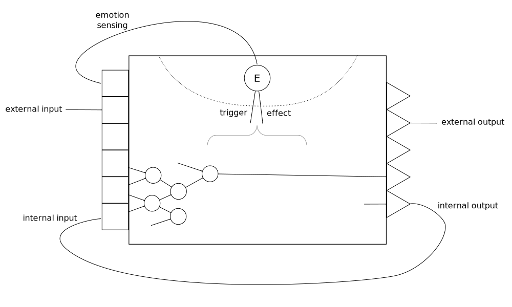

Engineering emotions
====================

_These are notes on managing global parameters in a family of cognitive
systems [introduced earlier](../2016-08-20-agi-project-status-2016).
They are conveniently named emotions, although our definition is
purely technical, broad, and doesn't attempt to emulate specific human
emotions._

An emotion is a specific value or range of values of a global
parameter of the system, which is built-in or inherited, affects the
activity of the system, is triggered by some states of the system, and
can be sensed by the system itself.

Sensing a combination of emotions and other input can result in what
we would call feelings, which are embodied by active nodes
like any other perceived concept in the system.

In the diagram below, the circled $E$ represents the global
parameter in the state corresponding to an emotion $E$.

Unlike input nodes (sensors) or output nodes (actuators) which are created by
IO modules, global parameters cannot be plugged-in using a standard
API. Their value is modified by states of the system that are not
accessible by IO modules and they have an effect on how the system
behaves internally.

Examples of possible trigger factors:

* familiarity/novelty: a large proportion of active nodes are old or
  young, respectively.
* importance: a large number or fraction of active nodes are estimated
              as important.
* incongruity: two or more high-confidence, high-importance concepts
               emerge but they have never co-occurred before.

Examples of possible effects:

* panic: no more experimentation with uncertain actions; only high-confidence
  actions can take place.
* relaxing: reduced learning activity, energy savings.

Unlike other neuron-like nodes in the system,
dynamic global parameters resulting in emotions have the following
properties:

* They exist during the whole life of the system.
* The rules for changing their values don't change during the lifetime
  of the system.
* The rules that determine their effects don't change during the
  lifetime of the system.
* There's no restriction on what part of the software they can affect.
