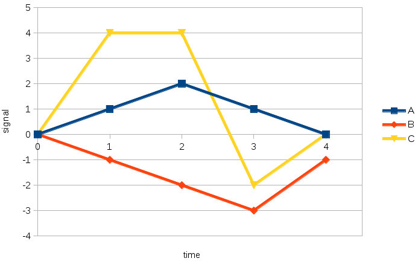

Real-time decomposition of a signal into a sum of responses to labeled events
=============================================================================

<!-- abstract -->

Goals
-----

<!-- motivation, role in greater AGI system -->

- goal function: rewards, penalties, self-rewards, self-penalties
- learn the impact of an action on the goal function

<!-- [constraint] effects can be delayed -->

<!-- [constraint] must work in the presence of overlapping effects -->

<!-- [constraint] learning must be incremental -->

<!-- [constraint] must adapt when responses change over time -->

Example:

Solution
--------

### Description

Define the following: labeled events, window, contributions, delta,
weights in delta correction

Link to implementation: https://github.com/mjambon/unitron

### Selected scenarios

- ideal scenario: constant contributions, linear, new events not
  overlapping with each other, window of 1
- window longer than 1?
- random noise on some contributions?
- random noise on all contributions?
- background noise on goal function?
- non-linear effects? (and how to deal with them in the context of AGI
  system where actions are fired by nodes representing concepts)
- systematically co-occurring events?
