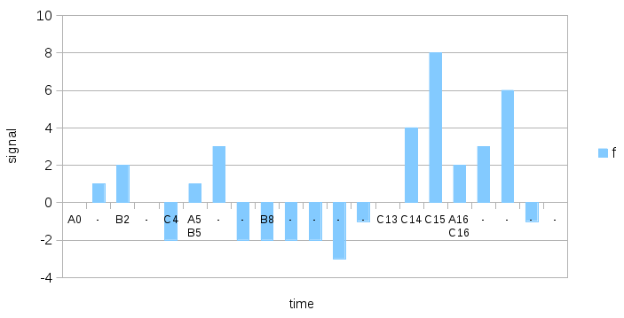

Real-time decomposition of a signal into a sum of responses to labeled events
=============================================================================

<!-- abstract -->

Motivation in the context of artificial general intelligence
------------------------------------------------------------

The problem we are trying to solve arises while developing a cognitive
system driven that operates in real-time and is driven by a single
goal function.
In this context, a goal function $\phi$ is a real-valued signal over
discrete time, whose value becomes available at each time step. It
represents how well the system is doing, i.e. it would combine rewards and
penalties. Some of these
rewards and penalties may correspond to direct interactions of the
system with its environment, such as acquiring food or losing energy.
Other rewards and penalties may be generated internally by the system
itself, as a way to encourage itself to pursue certain paths.

In such a cognitive system, there is a finite (but possibly growing)
collection of possible actions. Each action can be viewed as a
button. We call an act an instance of an action, i.e. the press of a
button. An act is a pair (action, time).
An action, naturally can correspond to a modification
of the system in its environment, such as an attempt to move
forward. It can also directly feed back into the system's input ports
without directly affecting the environment. No matter what kind of
action is triggered, it takes some amount of time to have an
effect on the goal function. Here and throughout this paper, we assume
that most meaningful effects of an action occur within a given time window,
which can be a short as 10 steps. We choose this window roughly to
capture reactions of the system to its own decisions, so it has enough
time to "realize" what it just did and produce a self-reward or a
self-penalty. Longer-term effects of course exist and will have to be
dealt with differently.

Given such a goal function $\phi$ and the knowledge of which actions were
triggered within a time window of length $w$, we wish to determine the
impact of each action on $\phi$.

General design contraints
-------------------------

### Independence from context

The response to an action is considered the same independently from
the context. In the case of artificial general intelligence (AGI),
this is generally not the case. However, it is possible to create as
many controls ("buttons") as there are contexts. Instead of studying
the response to an action regardless of the context, we can study the
response to the pair (context, action).

### Effects can be delayed

We wish to capture the "immediate" effects of an action. However, our
system is such that during a time step it can only propagate
information from one node to another. It is not organized into layers,
typically several steps are required for some input information to
reach the nodes in charge of triggering actions.

So, while we are only interested in the immediate effects of
actions, we need to leave sufficient time for the system to react to
such effects.

<!-- [constraint] must work in the presence of overlapping effects -->

<!-- [constraint] learning must be incremental -->

<!-- [constraint] must adapt when responses change over time -->

Example:

Solution
--------

### Description

Define the following: labeled events, window, contributions, delta,
weights in delta correction

Link to implementation: https://github.com/mjambon/unitron

### Selected scenarios

- ideal scenario: constant contributions, linear, new events not
  overlapping with each other, window of 1
- window longer than 1?
- random noise on some contributions?
- random noise on all contributions?
- background noise on goal function?
- non-linear effects? (and how to deal with them in the context of AGI
  system where actions are fired by nodes representing concepts)
- systematically co-occurring events?

References
----------

(moving average)
