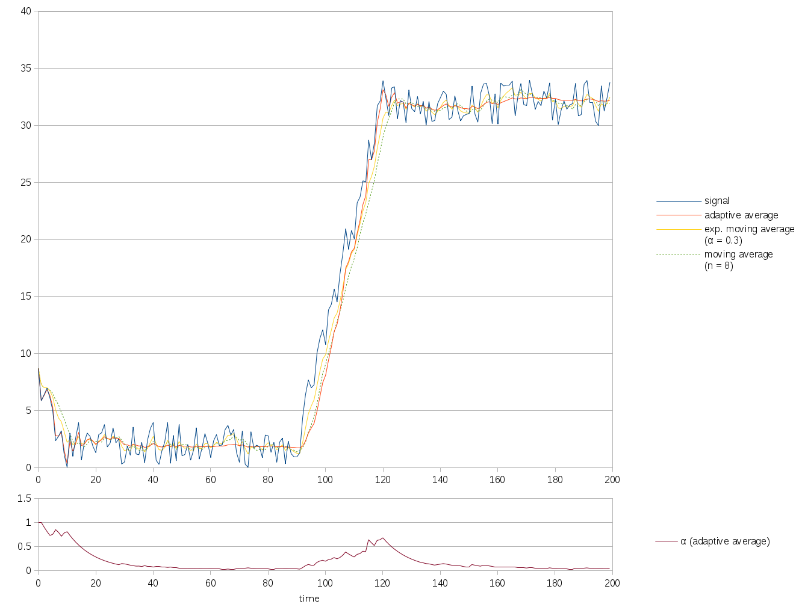
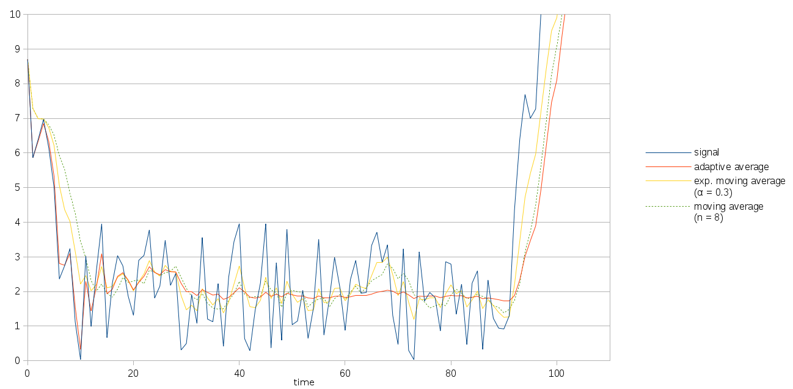

% An adaptive moving average
% Martin Jambon, August 2017

This document describes a moving average designed to reflect the
current value of a signal most accurately. This is an improvement over
exponential moving averages for some applications as it doesn't require
a trade-off between reactivity and smoothness.

Last revised: June 2018

<!-- toc -->

Goals
=====

This adaptive average was designed for signals that typically converge
toward some stable value. Such signals initially increase, decrease,
or oscillate at low frequencies.
During these phases, it is more important for the application
to track the latest values of the signal rather than the average over
past values which are no longer relevant. However, once the signal
stabilizes, we wish to remove noise as well as high frequency
components.

Other practical goals shared with other moving averages are that the
average can be computed at instant $t$ without knowledge of the
signal's value beyond $t$. Additionally, the algorithm must require
very little memory, which makes window-based algorithms like a simple
moving average not acceptable.

Method
======

The adaptive average is defined as an exponential moving average of
parameter $\alpha$ where $\alpha$ varies over time. The parameter
$\alpha$ at instant $t$ is denoted $\alpha_t$.

## Classic exponential moving average and variance

The exponential moving average $m$ of a function $f$ over
nonnegative integers is defined as:

$$
m_{f, \alpha} = t \rightarrow
\left\{
\begin{array}{ll}
  f_0                                  & t = 0\\
  (1-\alpha_t) \cdot m_{f,\alpha}(t-1) + \alpha_t \cdot f_t & t > 0
\end{array}
\right.
$$

where

$$
\alpha_t = \max
\left\{
\begin{array}{l}
  \frac{1}{t + 1} \\
  \alpha
\end{array}
\right.
$$

and $\alpha$ is the user-defined parameter in the range $[0, 1]$
that controls how much weight is given to recent values.

That is, past some initial phase, $\alpha_t$ is the constant $\alpha$.

An exponential moving variance $v$ is defined over positive integers
as an exponential moving average of the squared difference between the
signal $f$ and the previous moving average of $f$:

$$
\begin{eqnarray}
v_{f, \alpha, \alpha^\prime} &=& m_{g, \alpha^\prime}\\
g &=& t \rightarrow (f_t - m_{f, \alpha}(t-1))^2
\end{eqnarray}
$$

Note that $v$ is not defined for $t=0$. The moving standard deviation
is defined as the square root of the moving variance.

The parameters $\alpha$ and $\alpha^\prime$ may be set to identical values
but this is not a requirement.

## Adaptive average

The adaptive average $M(f)$ of a signal $f$ is defined like the
exponential moving average, except that $\alpha$ is no longer a
constant. Several numerical parameters are involved but the default
values that we use were found to work well and should be suitable for
most applications.
In what follows, $m$ designates a classic exponential moving
average.

The adaptive average $M$ is updated at instant $t$ as follows:

$$
M_t = \alpha_t \cdot f_t + (1-\alpha_t) \cdot M_{t-1}
$$

$\alpha$ now ranges between a minimum value $\alpha_{\min}$ and a
maximum $\alpha_{\max}$ as follows:

\begin{eqnarray}
\alpha_0 &=& \alpha_{\max} \\
\alpha_t &=&  \max
  \left\{
    \begin{array}{l}
      \alpha_{\min} + (\alpha_{\max} - \alpha_{\min}) \cdot I_t \\
      \mathrm{maxshrink} \cdot \alpha_{t-1} \\
    \end{array}
  \right.
\\
\alpha_{\min} &=& 0.01 \\
\alpha_{\max} &=& 1 \\
\mathrm{maxshrink} &=& 0.9 \\
\end{eqnarray}

where $I_t$ is the instability of the signal $f$. It is defined as:

\begin{eqnarray}
I_t &=&
   \left\{
    \begin{array}{ll}
      \frac{1 + \mathrm{sign}(d_t) \cdot |d_t|^{\mathrm{lowpower}}}{2}
        & \mathrm{traveled}_t \neq 0\\
      1
        & \mathrm{\mathrm{traveled}_t} = 0
    \end{array}
  \right.
\\

d_t &=& 2r_t - 1 \\
r_t &=& \frac{|\mathrm{elevation}_t|}{\mathrm{traveled}_t} \\

\mathrm{elevation} &=& m(\mathrm{slope}, \alpha_{gain}) \\
                   &=& \mathrm{gain} + \mathrm{loss} \\
\mathrm{traveled} &=& |\mathrm{gain}| + |\mathrm{loss}| \\
                  &=& \mathrm{gain} - \mathrm{loss} \\
\mathrm{gain} &=& m(\max(\mathrm{slope},0), \alpha_{\mathrm{gain}}) \\
\mathrm{loss} &=& m(\min(\mathrm{slope},0), \alpha_{\mathrm{gain}}) \\
\mathrm{slope}_t &=&
  \left\{
    \begin{array}{ll}
      f_t - f_{t-1} & t \ge 0 \\
      0             & t = 0
    \end{array}
  \right.
\\
\mathrm{lowpower} &=& 0.5 \\
\alpha_{\mathrm{gain}} &=& 0.05 \\
\end{eqnarray}

Implementing this recipe requires tracking two exponential moving
averages $\mathrm{gain}$ and $\mathrm{loss}$ of fixed parameter
$\alpha_{\mathrm{gain}}$. From these, the values of $\alpha$ are
determined at each time step.

Results
=======

The graph below shows a signal that first decreases (steps 0-10) before
stabilizing (steps 10-90). It then increases abruptly for some time
(90-110) before stabilizing again. The values of $\alpha$ as used in
the adaptive average are plotted below the main graph.

Note how the adaptive average (solid red) follows the signal (solid
blue) most closely in the following phases:

* initially and until the signal stabilizes (steps 0-20),
* as a reaction to an increase of the signal (steps 110-120)

However, when the signal becomes stable, $\alpha$ decreases despite the
noise, unlike the classic moving average that uses a window of fixed
length and unlike an exponential moving average of fixed parameter
(steps 30-90, 130-200).

The following is an enlarged version of the first half of the graph:

At the time of writing, a sample implementation is available as part of
[https://github.com/mjambon/moving-percentile](https://github.com/mjambon/moving-percentile),
as the modules
[`Mv_adapt`](https://github.com/mjambon/moving-percentile/blob/master/mv_adapt.ml)
and
[`Mv_adapt_avg`](https://github.com/mjambon/moving-percentile/blob/master/mv_adapt_avg.mli).
