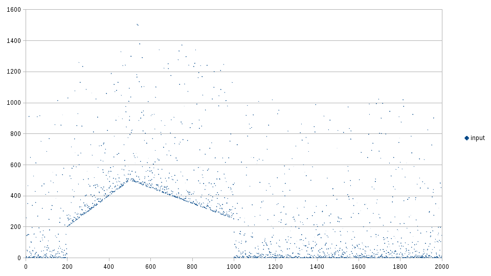
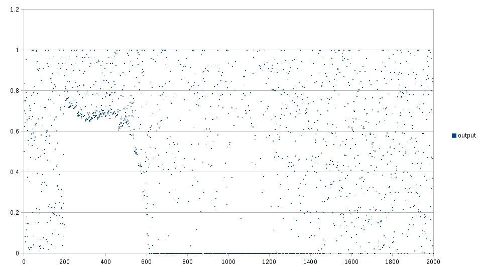

% Dynamic Signal Uniformization
% Martin Jambon, June 2020

<!-- toc -->

abstract

Introduction
==

Algorithm outline
==

Results
==

EMA $\alpha$ = 0.2,
number of bins = 20

Input:

Output:

Sample implementation
==

[https://github.com/mjambon/uniformize](https://github.com/mjambon/uniformize)
