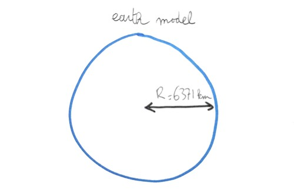
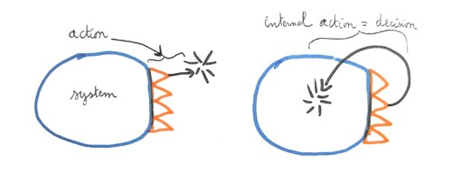

% Minimal Dictionary
I\'ve always wanted to communicate my general thoughts about the world
but didn\'t want to write a book for a few reasons. First, I have
limited talent for writing and I\'m not particularly interested in the
art of storytelling. Second, my thoughts change and by the time I would
be done writing a chapter, I would have changed my mind about it and
would have to rewrite the whole chapter, if not the rest of the book.
Third, concepts don\'t follow a particular order like a good story. Some
terms are defined independently from each other and the reader should
not have to read one before the other, nor should they have to work hard
to guess which chapters can be safely skipped. This is why instead of a
book made of chapters and paragraphs, I\'ve decided to use a dictionary
format, with the additional constraint that there be no cyclic
definitions.

The avoidance of mutually-dependent definitions results in an acyclic
[dependency graph](#dag) shown at the bottom of this page. It gives the
reader a quick view of which concepts are more foundational than others.

This dictionary is an attempt to define or clarify various terms I
consider important and unambiguous in my view of the world. Emphasis is
placed on simplicity, consistency, and approachability. If I deem the
approach successful, the document will [grow and evolve over
time](https://github.com/mjambon/blog/commits/master/src/2020-09-12-dictionary/glossary.yml).

[abstract](#vanity-6162737472616374){.vanity-term-link},
[action](#vanity-616374696f6e){.vanity-term-link},
[activity](#vanity-6163746976697479){.vanity-term-link},
[algorithm](#vanity-616c676f726974686d){.vanity-term-link},
[art](#vanity-617274){.vanity-term-link},
[artificial](#vanity-6172746966696369616c){.vanity-term-link},
[cognition](#vanity-636f676e6974696f6e){.vanity-term-link},
[communication](#vanity-636f6d6d756e69636174696f6e){.vanity-term-link},
[computation](#vanity-636f6d7075746174696f6e){.vanity-term-link},
[computer](#vanity-636f6d7075746572){.vanity-term-link},
[concept](#vanity-636f6e63657074){.vanity-term-link},
[concrete](#vanity-636f6e6372657465){.vanity-term-link},
[creation](#vanity-6372656174696f6e){.vanity-term-link},
[decision](#vanity-6465636973696f6e){.vanity-term-link},
[engineering](#vanity-656e67696e656572696e67){.vanity-term-link},
[environment](#vanity-656e7669726f6e6d656e74){.vanity-term-link},
[explicit
model](#vanity-6578706c69636974206d6f64656c){.vanity-term-link},
[feedback](#vanity-666565646261636b){.vanity-term-link}, [formal
language](#vanity-666f726d616c206c616e6775616765){.vanity-term-link},
[identity](#vanity-6964656e74697479){.vanity-term-link},
[imagination](#vanity-696d6167696e6174696f6e){.vanity-term-link},
[implicit
model](#vanity-696d706c69636974206d6f64656c){.vanity-term-link},
[individual](#vanity-696e646976696475616c){.vanity-term-link}, [informal
language](#vanity-696e666f726d616c206c616e6775616765){.vanity-term-link},
[intuition](#vanity-696e74756974696f6e){.vanity-term-link},
[language](#vanity-6c616e6775616765){.vanity-term-link},
[logic](#vanity-6c6f676963){.vanity-term-link},
[mathematics](#vanity-6d617468656d6174696373){.vanity-term-link},
[mind](#vanity-6d696e64){.vanity-term-link},
[model](#vanity-6d6f64656c){.vanity-term-link},
[mutable](#vanity-6d757461626c65){.vanity-term-link},
[nature](#vanity-6e6174757265){.vanity-term-link},
[optimization](#vanity-6f7074696d697a6174696f6e){.vanity-term-link},
[parameter](#vanity-706172616d65746572){.vanity-term-link},
[perception](#vanity-70657263657074696f6e){.vanity-term-link},
[program](#vanity-70726f6772616d){.vanity-term-link},
[reaction](#vanity-7265616374696f6e){.vanity-term-link},
[reasoning](#vanity-726561736f6e696e67){.vanity-term-link},
[rule](#vanity-72756c65){.vanity-term-link},
[science](#vanity-736369656e6365){.vanity-term-link},
[sensing](#vanity-73656e73696e67){.vanity-term-link},
[sentence](#vanity-73656e74656e6365){.vanity-term-link},
[set](#vanity-736574){.vanity-term-link},
[society](#vanity-736f6369657479){.vanity-term-link},
[state](#vanity-7374617465){.vanity-term-link},
[symbol](#vanity-73796d626f6c){.vanity-term-link},
[system](#vanity-73797374656d){.vanity-term-link},
[taboo](#vanity-7461626f6f){.vanity-term-link},
[time](#vanity-74696d65){.vanity-term-link},
[tool](#vanity-746f6f6c){.vanity-term-link},
[understanding](#vanity-756e6465727374616e64696e67){.vanity-term-link},
[world](#vanity-776f726c64){.vanity-term-link}

[]{#vanity-776f726c64}**world**: [A subject of study plus everything
that interacts with it directly or indirectly. It is normally referred
to as \"the\" world because it is everything that exists from the
subject\'s perspective. An interaction can be modeled as a flow of
information, for some definition of information to be specified. A world
is isolated from everything else, and therefore anything modeled within
the world cannot learn anything about the existence or the nature of
other worlds. ]{.vanity-contents}

::: {.vanity-image-div}
[{.vanity-image-img}](img/world.jpg)
:::

[]{#vanity-6d6f64656c}**model**: [An unambiguous representation of the
[world](#vanity-776f726c64){.vanity-term-link}. As such, a model can in
principle, given sufficient technology, be translated into another
language and recovered back without loss. A model is necessarily simpler
than the world in which it can be expressed. An example of a simple
model is the representation of the sun and the earth as points in a
2-dimensional Euclidean space, with the sun being immobile and the earth
rotating in a circular orbit over a one-year period. Elementary
mathematical knowledge is sufficient to read and copy this model without
mistakes. Our definition of a model includes any arrangement of
information that is believed to form a world model but may not be
accessed or copied in its entirety. For example, a human body, mostly in
its brain, holds world model, some of which was learned by interacting
with it since birth. While we may not have the technology to copy
correctly and completely the relevant information from a human brain, we
assume it\'s all in there. Such world model that\'s a necessary part of
any human mind shall not be confused with whatever explicit models a
thinker or scientist can construct and publish. ]{.vanity-contents}

::: {.vanity-image-div}
[{.vanity-image-img}](img/earth-model.jpg)
:::

[]{#vanity-74696d65}**time**: [An ordering over the states of a
[model](#vanity-6d6f64656c){.vanity-term-link}. Time is the breakdown of
a model into a sequence of objects called states with constraints over
those states. A more specific definition of time is part of each model,
if the model relies on such notion of time or successive states. Unless
otherwise specified, the stepwise execution of computer programs uses a
discrete, nonnegative index t to reference the successive steps of a
computation. An ideal scenario is a computation of discrete states
starting from an initial state t = 0 and a transition function. The
transition function computes the next state from the previous one. Such
computations are called simulations. More generally however, when there
is no need for computing successive states, time is usually modeled as
the real line. ]{.vanity-contents}

::: {.vanity-image-div}
[{.vanity-image-img}](img/time.jpg)
:::

[]{#vanity-73797374656d}**system**: [A system refers to a partial
[model](#vanity-6d6f64656c){.vanity-term-link}. It can be obtained by
taking some elements of a [world](#vanity-776f726c64){.vanity-term-link}
model and ignoring all interactions with the rest of the world, or by
modeling the rest of the world in a simpler manner than in the original
model. For example, modeling a car could consist in retaining a model of
the car components as well as a model of a road and how the car
interacts with the road, discarding all other elements of the world such
as buildings and trees. In this example, the car is the system and the
road is the rest of the world. ]{.vanity-contents}

::: {.vanity-image-div}
[{.vanity-image-img}](img/system.jpg)
:::

[]{#vanity-656e7669726f6e6d656e74}**environment**: [In a
[model](#vanity-6d6f64656c){.vanity-term-link} comprising
[systems](#vanity-73797374656d){.vanity-term-link}, the environment
refers to everything in the model that\'s not part of the system under
consideration. ]{.vanity-contents}

::: {.vanity-image-div}
[{.vanity-image-img}](img/environment.jpg)
:::

[]{#vanity-73656e73696e67}**sensing**: [The acquisition of raw data by a
[system](#vanity-73797374656d){.vanity-term-link} from the
[environment](#vanity-656e7669726f6e6d656e74){.vanity-term-link}. This
is usually done by special-purpose parts of the system, which are called
sensors. ]{.vanity-contents}

::: {.vanity-image-div}
[{.vanity-image-img}](img/sensing.jpg)
:::

[]{#vanity-706172616d65746572}**parameter**: [A parameter of a
[model](#vanity-6d6f64656c){.vanity-term-link} is any property of this
model that is left unspecified, defining a function in the usual
mathematical sense. In general, a model can have any number of
parameters. ]{.vanity-contents}

[]{#vanity-7374617465}**state**: [A particular instantiation of the
[parameters](#vanity-706172616d65746572){.vanity-term-link} of a
[model](#vanity-6d6f64656c){.vanity-term-link}. ]{.vanity-contents}

::: {.vanity-image-div}
[{.vanity-image-img}](img/state.jpg)
:::

[]{#vanity-6d757461626c65}**mutable**: [An entity is said mutable when
it consists of [time](#vanity-74696d65){.vanity-term-link}-indexed
sequence of [states](#vanity-7374617465){.vanity-term-link}. Such
sequence of states is meant to represent successive transformation of an
initial object within a model. ]{.vanity-contents}

[]{#vanity-696e646976696475616c}**individual**: [In a
[model](#vanity-6d6f64656c){.vanity-term-link} of the
[world](#vanity-776f726c64){.vanity-term-link}, an individual is a
[mutable](#vanity-6d757461626c65){.vanity-term-link}
[system](#vanity-73797374656d){.vanity-term-link} which interacts with
the rest of world, including other individuals. Each individual exists
for some continuous period of
[time](#vanity-74696d65){.vanity-term-link}, usually in a binary
fashion: at a given time, the individual either exists or doesn\'t
exist. ]{.vanity-contents}

::: {.vanity-image-div}
[{.vanity-image-img}](img/individual.jpg)
:::

[]{#vanity-6172746966696369616c}**artificial**: [The property of being
created by
[individuals](#vanity-696e646976696475616c){.vanity-term-link}, as
opposed to being imposed by the
[model](#vanity-6d6f64656c){.vanity-term-link} of the
[world](#vanity-776f726c64){.vanity-term-link} in which the individuals
exist. ]{.vanity-contents}

[]{#vanity-6964656e74697479}**identity**: [The collection of properties
associated with an
[individual](#vanity-696e646976696475616c){.vanity-term-link}.
]{.vanity-contents}

[]{#vanity-736574}**set**: [A set as defined in mathematics by the
axioms of set theory. ]{.vanity-contents}

[]{#vanity-72756c65}**rule**: [An
[artificial](#vanity-6172746966696369616c){.vanity-term-link}
constraint. Unlike a physical constraint which can apply to various
portions of a [model](#vanity-6d6f64656c){.vanity-term-link}, an
artificial constraint applies to
[individual](#vanity-696e646976696475616c){.vanity-term-link} members of
a society, and said members can decide whether to follow it.
]{.vanity-contents}

[]{#vanity-736f6369657479}**society**: [A
[set](#vanity-736574){.vanity-term-link} of
[individuals](#vanity-696e646976696475616c){.vanity-term-link} known as
society members within a [model](#vanity-6d6f64656c){.vanity-term-link}
of the [world](#vanity-776f726c64){.vanity-term-link}, and associated
with [rules](#vanity-72756c65){.vanity-term-link}. ]{.vanity-contents}

[]{#vanity-6e6174757265}**nature**: [A model of the world without a
[society](#vanity-736f6369657479){.vanity-term-link}.
]{.vanity-contents}

[]{#vanity-746f6f6c}**tool**: [A tool, in the very general sense that
interests us, is an extension of what\'s normally considered the body of
an individual and facilitates their interaction with the
[environment](#vanity-656e7669726f6e6d656e74){.vanity-term-link}. This
definition includes all machines, methods, and processes stored outside
of the normal body of an individual. In the usual human world, this
includes not just physical devices such as a hammer or a computer, but
also all data stored outside the body such as books and other
recordings. Therefore, other individuals can also be considered as tools
according this definition. ]{.vanity-contents}

::: {.vanity-image-div}
[{.vanity-image-img}](img/tool.jpg)
:::

[]{#vanity-6163746976697479}**activity**: [Collection of events
involving [individuals](#vanity-696e646976696475616c){.vanity-term-link}
using specific [tools](#vanity-746f6f6c){.vanity-term-link} or methods.
]{.vanity-contents}

[]{#vanity-736369656e6365}**science**: [The
[activity](#vanity-6163746976697479){.vanity-term-link} consisting in
creating and refining [models](#vanity-6d6f64656c){.vanity-term-link} of
the [world](#vanity-776f726c64){.vanity-term-link}. ]{.vanity-contents}

[]{#vanity-6372656174696f6e}**creation**:
[[Activity](#vanity-6163746976697479){.vanity-term-link} whose impact on
the [world](#vanity-776f726c64){.vanity-term-link} is noticed and
becomes associated with a new concept, in some
[model](#vanity-6d6f64656c){.vanity-term-link} of interest.
]{.vanity-contents}

[]{#vanity-656e67696e656572696e67}**engineering**: [The
[activity](#vanity-6163746976697479){.vanity-term-link} of
[creating](#vanity-6372656174696f6e){.vanity-term-link}
[tools](#vanity-746f6f6c){.vanity-term-link}. ]{.vanity-contents}

[]{#vanity-617274}**art**: [The
[activity](#vanity-6163746976697479){.vanity-term-link} of
[creating](#vanity-6372656174696f6e){.vanity-term-link} anything that is
not a [tool](#vanity-746f6f6c){.vanity-term-link}. ]{.vanity-contents}

[]{#vanity-6d617468656d6174696373}**mathematics**: [The study of the
structure of unambiguous statements. Mathematics are useful for dealing
with [models](#vanity-6d6f64656c){.vanity-term-link} in
[science](#vanity-736369656e6365){.vanity-term-link},
[engineering](#vanity-656e67696e656572696e67){.vanity-term-link}, and
other fields of study. ]{.vanity-contents}

[]{#vanity-636f6d7075746572}**computer**: [A finite
[system](#vanity-73797374656d){.vanity-term-link} that reads discrete
instructions and carries them out predictably. A computer can be
[represented](#vanity-6d6f64656c){.vanity-term-link} as a sequence of
[states](#vanity-7374617465){.vanity-term-link} comprising a
[mutable](#vanity-6d757461626c65){.vanity-term-link}, discrete storage
space. Turing machines are idealized representations of computers with
unbounded storage or memory; they are used in theoretical studies for
proving some properties of computers. This definition excludes
hypercomputers, which would allow solving problems that Turing machines
cannot, such as the halting problem. ]{.vanity-contents}

[]{#vanity-6c6f676963}**logic**: [The
[mathematical](#vanity-6d617468656d6174696373){.vanity-term-link}
subfield of logic. It is focused on the general properties of formal
systems and characterizing what can and cannot be done with mathematics
and [computers](#vanity-636f6d7075746572){.vanity-term-link}.
]{.vanity-contents}

[]{#vanity-636f6d7075746174696f6e}**computation**: [The
[successive](#vanity-74696d65){.vanity-term-link}
[states](#vanity-7374617465){.vanity-term-link} of a
[computer](#vanity-636f6d7075746572){.vanity-term-link}.
]{.vanity-contents}

[]{#vanity-70726f6772616d}**program**: [A computer program in the usual
sense. A program consists of a finite collection of instructions that
can be executed by a computer or by a Turing machine. A program may or
may not take external input. In theoretical studies, the input is often
baked into the program or into the initial state of the computer\'s
memory. A program may or not terminate. Determining whether a program
terminates is not always possible, which is known as the halting
problem. A program can be viewed as a mathematical proof and vice-versa,
which is known as the Curry-Howard correspondence, and offers a link
between [logic](#vanity-6c6f676963){.vanity-term-link} and
[computation](#vanity-636f6d7075746174696f6e){.vanity-term-link}.
]{.vanity-contents}

[]{#vanity-616c676f726974686d}**algorithm**: [An algorithm is a
[program](#vanity-70726f6772616d){.vanity-term-link} that terminates.
]{.vanity-contents}

[]{#vanity-616374696f6e}**action**: [A change in two
[successive](#vanity-74696d65){.vanity-term-link}
[states](#vanity-7374617465){.vanity-term-link} of a
[system](#vanity-73797374656d){.vanity-term-link} that determines a
change elsewhere in the [world](#vanity-776f726c64){.vanity-term-link}
[model](#vanity-6d6f64656c){.vanity-term-link}, possibly in the system
itself. ]{.vanity-contents}

[]{#vanity-6465636973696f6e}**decision**: [An
[action](#vanity-616374696f6e){.vanity-term-link} of a
[system](#vanity-73797374656d){.vanity-term-link} onto itself, in
particular when examining a small selection of possible actions that are
mutually exclusive. ]{.vanity-contents}

::: {.vanity-image-div}
[{.vanity-image-img}](img/actions.jpg)
:::

[]{#vanity-6d696e64}**mind**: [(1) The components of a
[system](#vanity-73797374656d){.vanity-term-link} that make it more
durable independently from its other properties. This tentative
definition is meant to incorporate the dualist notion that the mind is
separate from the rest of the body and somewhat optional, while
emphasizing that it\'s only a simplified model useful for studying
[decision](#vanity-6465636973696f6e){.vanity-term-link}
[processes](#vanity-636f6d7075746174696f6e){.vanity-term-link}. (2) A
self-improving [world](#vanity-776f726c64){.vanity-term-link}
[model](#vanity-6d6f64656c){.vanity-term-link}. In this equivalent view,
the mind continuously gathers information about the
[environment](#vanity-656e7669726f6e6d656e74){.vanity-term-link} around
the system and uses it to make better decisions. ]{.vanity-contents}

[]{#vanity-636f676e6974696f6e}**cognition**: [The properties of a
[mind](#vanity-6d696e64){.vanity-term-link}. ]{.vanity-contents}

[]{#vanity-636f6e63657074}**concept**: [A binary state within a
[mind](#vanity-6d696e64){.vanity-term-link}. A concept is generally
considered to be turned on or off by the activity of the mind, including
other concepts. ]{.vanity-contents}

[]{#vanity-6162737472616374}**abstract**: [A
[concept](#vanity-636f6e63657074){.vanity-term-link} is said more
abstract than another when its full definition from elementary concepts
is more complex. ]{.vanity-contents}

[]{#vanity-636f6e6372657465}**concrete**: [The opposite of
[abstract](#vanity-6162737472616374){.vanity-term-link}. A
[concept](#vanity-636f6e63657074){.vanity-term-link} is more concrete
than another when it is less abstract. In a
[mind](#vanity-6d696e64){.vanity-term-link}, the most concrete concepts
are the [states](#vanity-7374617465){.vanity-term-link} of
[sensors](#vanity-73656e73696e67){.vanity-term-link}.
]{.vanity-contents}

[]{#vanity-696e74756974696f6e}**intuition**: [The activation of
[abstract](#vanity-6162737472616374){.vanity-term-link}
[concepts](#vanity-636f6e63657074){.vanity-term-link} or ideas within a
[mind](#vanity-6d696e64){.vanity-term-link}. ]{.vanity-contents}

[]{#vanity-70657263657074696f6e}**perception**: [A form of
[intuition](#vanity-696e74756974696f6e){.vanity-term-link} involving
[concepts](#vanity-636f6e63657074){.vanity-term-link} that form a
[model](#vanity-6d6f64656c){.vanity-term-link} of the
[world](#vanity-776f726c64){.vanity-term-link} as it is being
[sensed](#vanity-73656e73696e67){.vanity-term-link}. ]{.vanity-contents}

[]{#vanity-7265616374696f6e}**reaction**: [An
[action](#vanity-616374696f6e){.vanity-term-link} that is triggered
within a [mind](#vanity-6d696e64){.vanity-term-link} by the presence of
a particular [concept](#vanity-636f6e63657074){.vanity-term-link}.
]{.vanity-contents}

[]{#vanity-6f7074696d697a6174696f6e}**optimization**: [An activity
consisting in modifying a
[system](#vanity-73797374656d){.vanity-term-link} so as to increase its
fitness, which is a number, specifically an element taken from an
ordered set. The goal function, objective function or fitness function
is the function that maps a
[state](#vanity-7374617465){.vanity-term-link} of a system to the number
referred to as fitness. ]{.vanity-contents}

[]{#vanity-666565646261636b}**feedback**: [Input of the
[fitness](#vanity-6f7074696d697a6174696f6e){.vanity-term-link} function
of a [system](#vanity-73797374656d){.vanity-term-link}.
]{.vanity-contents}

[]{#vanity-73796d626f6c}**symbol**: [A conventional representation of a
[concept](#vanity-636f6e63657074){.vanity-term-link}. It is a component
of the [world](#vanity-776f726c64){.vanity-term-link} to which some
members of a [society](#vanity-736f6369657479){.vanity-term-link} will
[react](#vanity-7265616374696f6e){.vanity-term-link} in a similar manner
and that does not provide
[benefits](#vanity-6f7074696d697a6174696f6e){.vanity-term-link} other
than eliciting similar reactions in others. A special case of a symbol
is one that\'s used only by a single
[individual](#vanity-696e646976696475616c){.vanity-term-link}. It
suffices that the concept be identified as such by the individual to be
considered a symbol. For example, \"that feeling when I do X\" shall be
considered an internal symbol because it\'s a concept whose presence is
clearly identified by the subject. The subject might then try to
reproduce it with the aim of eliciting a particular
[reaction](#vanity-7265616374696f6e){.vanity-term-link} in their own
[mind](#vanity-6d696e64){.vanity-term-link}. ]{.vanity-contents}

[]{#vanity-726561736f6e696e67}**reasoning**: [Any
[mental](#vanity-6d696e64){.vanity-term-link} activity that makes heavy
use of [symbols](#vanity-73796d626f6c){.vanity-term-link}.
]{.vanity-contents}

[]{#vanity-73656e74656e6365}**sentence**: [A sentence is a compound
[symbol](#vanity-73796d626f6c){.vanity-term-link} i.e. a symbol formed
by combining multiple symbols into one. ]{.vanity-contents}

[]{#vanity-6c616e6775616765}**language**: [A collection of
[symbols](#vanity-73796d626f6c){.vanity-term-link} produced by combining
other symbols. A combination of symbols that itself forms a symbol is
referred to as a [compound
symbol](#vanity-73656e74656e6365){.vanity-term-link} or a
[sentence](#vanity-73656e74656e6365){.vanity-term-link}. One shall
distinguish formal languages from informal languages.
]{.vanity-contents}

[]{#vanity-696e666f726d616c206c616e6775616765}**informal language**: [An
informal language is a
[language](#vanity-6c616e6775616765){.vanity-term-link} made of
ambiguous [symbols](#vanity-73796d626f6c){.vanity-term-link}. A simple
symbol or a [compound
symbol](#vanity-73656e74656e6365){.vanity-term-link} is ambiguous if it
elicits different
[reactions](#vanity-7265616374696f6e){.vanity-term-link} in different
people. For example, a simple English sentence like \"the sky is blue\"
is ambiguous at least because different people have different notions of
the color blue or whether this claim asserts that the sky is always
blue. The missing details are usually called \"context\" but for an
informal language, it is not possible to provide all the context for a
[sentence](#vanity-73656e74656e6365){.vanity-term-link} to become
unambiguous. What prevents this is how each
[mind](#vanity-6d696e64){.vanity-term-link} produces
[concepts](#vanity-636f6e63657074){.vanity-term-link} and reacts to them
as a function of its own state rather than just as a function of new
external data. ]{.vanity-contents}

[]{#vanity-666f726d616c206c616e6775616765}**formal language**: [A formal
language is a [language](#vanity-6c616e6775616765){.vanity-term-link}
defined mathematically, or equivalently unambiguously. Most programming
languages can be thought of as formal languages, even if in practice
certain aspects of the language are left undefined. Another example of
\"almost formal\" languages are mathematical proofs. While ordinary
mathematical proofs are expressed in a natural language such as English,
they are believed to be translatable into one or more equivalent
proof-checking
[algorithms](#vanity-616c676f726974686d){.vanity-term-link} by different
people. Since not everyone understands a given mathematical proof, the
key is to convince the audience that they understand the proof only if
they really do. As a shortcut, we might therefore allow ourselves to
treat most mathematical discourse as using a formal language. This
contrasts with everyday [informal
languages](#vanity-696e666f726d616c206c616e6775616765){.vanity-term-link},
which are not believed nor designed to be unambiguous.
]{.vanity-contents}

[]{#vanity-696d6167696e6174696f6e}**imagination**: [A form of
[intuition](#vanity-696e74756974696f6e){.vanity-term-link}, generally
involving [concepts](#vanity-636f6e63657074){.vanity-term-link} for
which [symbols](#vanity-73796d626f6c){.vanity-term-link} already exist.
]{.vanity-contents}

[]{#vanity-696d706c69636974206d6f64656c}**implicit model**: [A
[model](#vanity-6d6f64656c){.vanity-term-link} implemented by a
[mind](#vanity-6d696e64){.vanity-term-link}. A mind makes
[decisions](#vanity-6465636973696f6e){.vanity-term-link} at least
partially by relying on some internal structure in the
[system](#vanity-73797374656d){.vanity-term-link}, without relying on a
[symbolism](#vanity-73796d626f6c){.vanity-term-link} or language that
makes it transferable to other
[individuals](#vanity-696e646976696475616c){.vanity-term-link}. This
internal structure is considered an implicit world model.
]{.vanity-contents}

[]{#vanity-6578706c69636974206d6f64656c}**explicit model**: [A
[model](#vanity-6d6f64656c){.vanity-term-link} transferable by a
[system](#vanity-73797374656d){.vanity-term-link} to another system
using [symbols](#vanity-73796d626f6c){.vanity-term-link} forming a
language. ]{.vanity-contents}

[]{#vanity-756e6465727374616e64696e67}**understanding**: [(1) Some
measure of how much a [mind](#vanity-6d696e64){.vanity-term-link}
reproduces
[implicitly](#vanity-696d706c69636974206d6f64656c){.vanity-term-link}
the essential features of some external
[model](#vanity-6d6f64656c){.vanity-term-link}. It can be tested by
placing the mind in an
[environment](#vanity-656e7669726f6e6d656e74){.vanity-term-link} that
requires quick [decisions](#vanity-6465636973696f6e){.vanity-term-link}
that benefit from identifying features of the model without much
[computation](#vanity-636f6d7075746174696f6e){.vanity-term-link}. (2)
The properties of a mind that allow it to extend its implicit
[world](#vanity-776f726c64){.vanity-term-link} model.
]{.vanity-contents}

[]{#vanity-636f6d6d756e69636174696f6e}**communication**: [Transfer of
[concepts](#vanity-636f6e63657074){.vanity-term-link} from an
[individual](#vanity-696e646976696475616c){.vanity-term-link} to other
individuals. A concept is the activation of a construct within a
particular [mind](#vanity-6d696e64){.vanity-term-link}. In general and
ideally, two individuals with similar experience and exposed to the same
input will activate approximately equivalent concepts. For example, when
seeing an apple, some kind of neuron may light up, corresponding to the
approximately defined concept of \"an apple being present in front of
them\". We distinguish concepts, which are internal to each mind, from
[symbols](#vanity-73796d626f6c){.vanity-term-link} which are
placeholders meant to activate, trigger, or elicit a particular concept.
Communication may or may not rely on symbols.
[Language](#vanity-6c616e6775616765){.vanity-term-link} relies on
symbols to represent concepts. An example of communication without
symbols is teaching by example, such as an animal showing their
offspring how to catch prey by just doing it. ]{.vanity-contents}

[]{#vanity-7461626f6f}**taboo**: [A
[concept](#vanity-636f6e63657074){.vanity-term-link} that is being
avoided by one or more
[individuals](#vanity-696e646976696475616c){.vanity-term-link}. Keeping
in mind that a concept is the activation of a particular state of the
[mind](#vanity-6d696e64){.vanity-term-link}, avoiding a concept is a
complex process. It takes the mind some training that consists in
identifying situations that may lead to the concept, and favoring
[decisions](#vanity-6465636973696f6e){.vanity-term-link} that take the
focus away from the taboo concept. It is important to distinguish a
taboo from any undesirable situation. A taboo concept is not just about
avoiding a specific situation but also avoiding thinking about it. For
example, the concept \"a tiger is attacking me\" for most people is not
taboo because we don\'t have a problem imagining this. The actual
concept that we want to avoid is \"the tiger is attacking me right now
for real\". A taboo is a concept that is completely avoided, possibly
due to threats
[communicated](#vanity-636f6d6d756e69636174696f6e){.vanity-term-link} by
others or more generally due to fear caused by
[negative](#vanity-666565646261636b){.vanity-term-link} past experience
involving co-occurring concepts. ]{.vanity-contents}

[]{#dag}

