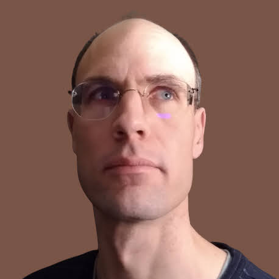

% Martin Jambon

I'm a software developer, creator, and researcher. Originally from
France, I live in the San Francisco Bay Area.

<code>martin@mjambon.com</code>
&bull; [Twitter](https://twitter.com/mjambon)
&bull; [GitHub](https://github.com/mjambon)
&bull; [LinkedIn](https://www.linkedin.com/in/mjambon)
&bull; [Flickr](https://www.flickr.com/photos/mjambon)
&bull; [Strava](http://www.strava.com/athletes/750791)

Artificial cognition
--

In my personal time, I develop theories and software for creating
machines that will live their own lives and take care of themselves.
The emphasis is on developing a general form of proto-intelligence
first, and not any specific application. This endeavor is more of an
art project than an industrial project, as ultimately it is about
creating artificial individuals, not tools.

The implementation of the
[architecture laid out in 2016](2016-08-20-agi-project-status-2016) is
still ongoing as of 2022. It is now closed-source.

### Definitions

* [Minimal Dictionary](dictionary) (2020-): small dictionary of
  basic terms loosely related to natural and artificial minds and their
  interaction with the world. It is structured as a DAG, forbidding
  cyclic definitions.
* [Artificial cognition glossary](2019-04-21-glossary) (2019-): glossary of
  technical terms used in my own work on designing artificial minds.

### Technical reports

* [Dynamic signal uniformization](2020-06-28-dynamic-signal-uniformization)
  (June 2020)
* [An adaptive moving average](2017-08-12-adaptive-average)
  (August 2017)
* [Real-time decomposition of a signal into a sum of responses to
  labeled events](2017-07-02-linear-response-decomposition)
  (July 2017)
* [Discrete concepts and discrete time](2016-09-03-discrete-indicators):
  A proposed basis for the design of engineerable intelligent systems
  (September 2016)
* [AGI research snapshot, 2016](2016-08-20-agi-project-status-2016)
  (August 2016)
* [Windowless percentile tracking](2016-07-23-moving-percentile)
  (July 2016)

### Ideas

* [Notes](notes) A growing collection of short notes (2022-)
* [Mind ≠ Identity](2021-12-31-mind-vs-identity) (December 2021)
* [Current interests (March 2017)](2017-03-05-current-interests)
* [A world of intelligent machines](2017-01-02-agi-world) (January 2017)
* [Engineering emotions](2016-12-31-agi-emotions) (December 2016)
* [Deep vs. fast thinking:
  a synchronization problem](2015-11-08-deep-vs-fast-thinking)
  (November 2015)
* [Intelligence precedes machines](2014-12-31-intelligence-precedes-machines)
  (December 2014)

Miscellaneous blog posts
--

* [Signs they're an authoritarian](2020-12-25-authoritarian) (2020)
* [Software engineering
  notes](2020-03-29-software-engineering-notes) (2020)
* [Issue Voting](2017-01-08-issue-voting-method) (2017): a proposed
  voting method
* [Diversity rule: a voting system that accommodates
  minorities](2016-10-08-diversity-rule) (2016)
* [Product ideas](2016-07-30-product-ideas) (2016)
* [Definitions of life](2016-07-24-definitions-of-life) (2016)
* [Universal career advice](2015-01-03-universal-career-advice) (2015)
* [Faith-driven science](2014-12-27-faith-driven-science) (2014)

Proofs-of-concept
--

These original ideas come with some implementation that works, but aren't
widely known or used by many. Work would be needed to publicize them
or make them widely accessible.

* [vanity](https://github.com/mjambon/vanity) (2020): Validation and
  formatting of acyclic dictionaries. The goal is to allow thinkers to
  present their respective world views in a concise and unambiguous
  manner, without resorting to mathematical formalism.
* [unpurple](https://github.com/mjambon/purple-fringe) (2012):
  An algorithm for removing purple-fringe defects from
  photos. Now available to all in GIMP via G'MIC.
* [dutop](https://github.com/mjambon/dutop) (2011): A command for
  identifying the subtrees which take up the most space in a file
  system. Typically used when running into "no space left on device"
  errors.
* [wcl](https://github.com/mjambon/wcl) (2011): A command for
  estimating the number of lines of large files. Useful when dealing
  routinely with 100,000,000 records or more.

Notable open-source projects
--

These tools have been or were used professionally by multiple independent
users. They were all initiated by me, with or without support from
an employer.

* [dune-deps](https://github.com/mjambon/dune-deps) (2020): Extracts
  a useful dependency graph from an OCaml project.
* [atd](https://github.com/ahrefs/atd) (2010): Code generator for
  making JSON pleasant and flexible to use with OCaml. Comes with its
  own type definition language designed to be adaptable to various data
  formats and programming languages.
* [yojson](https://github.com/ocaml-community/yojson) (2010): JSON
  parsers supporting atd. Turned out to be widely used as is by many
  OCaml users.
* [cppo](https://github.com/ocaml-community/cppo) (2009):
  Straightforward C-style preprocessor for OCaml. Used typically
  as a last resort to deal with compatibility issues across different
  versions of libraries.
* [mikmatch](https://github.com/mjambon/mikmatch) (2004, defunct):
  extension of OCaml's ML-style pattern-matching syntax with
  regexps. Was based on Camlp4 which since has fallen from grace.

Structural bioinformatics (2000-2007)
--

For my PhD and postdoc, I worked on tools to study the 3D structure of
proteins. While my postdoc experience wasn't a thrill
scientifically speaking, I some moderate success with my PhD work in
France.

The SuMo project (2000-2003) was an attempt to identify local
similarities among unrelated 3D structures of proteins, in the hope that
they would share a similar biological function.

This involved complex heuristics for somewhat limited results.
It permanently convinced me that a system capable of forming its own
intuition about the behavior of proteins would be the key to
solving this problem, and many others.

In the process, I became a scientific poster enthusiast. Here's an
example of my creations, which I presented at an international
conference in 2005:

Publications relevant to the SuMo project:

* Jambon, M. A bioinformatic system for searching functional similarities
  in 3D structures of proteins.
  Doctoral thesis. Université Claude Bernard - Lyon 1.
  [June 20, 2003](paper/proteins/sumo-letter-oneside.pdf)
  \[[French original](paper/proteins/sumo-french.pdf)\].
* Jambon, M. and Imberty, A. and Deleage, G. and Geourjon, C.
  A new bioinformatic approach to detect common 3D sites in protein structures.
  <a href="paper/proteins/sumo2003.pdf">Proteins 2003 Aug 1; 52(2):137-45</a>.
* Jambon M, Andrieu O, Combet C, Deleage G, Delfaud F, Geourjon C.
  The SuMo server: 3D search for protein functional sites.
  <a href="paper/proteins/sumo2005.pdf">Bioinformatics.
  2005 Sep 1; 21(20):3929­3930</a>.

Original artwork (2022-present)
--

Visit [my portfolio](https://martinj.art) or [my entire collection](gallery).

<figure style="margin: 0px 1%; padding-top: 40px">

<figcaption style="color:#666; margin: 1em 0em">

Space nugget, 2022

</figcaption>
</figure>
